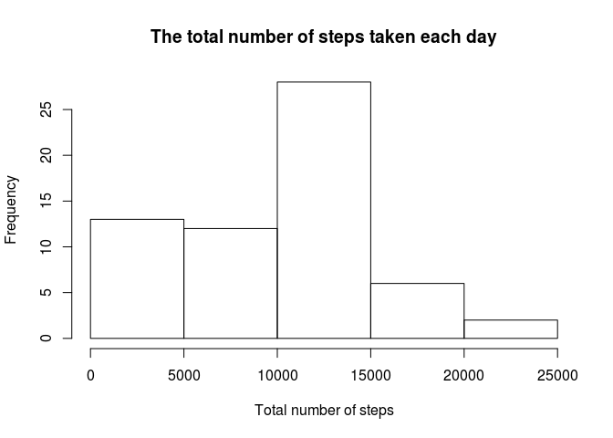
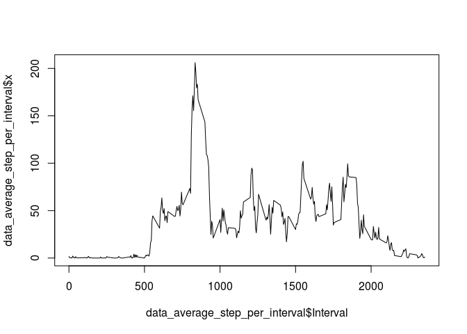
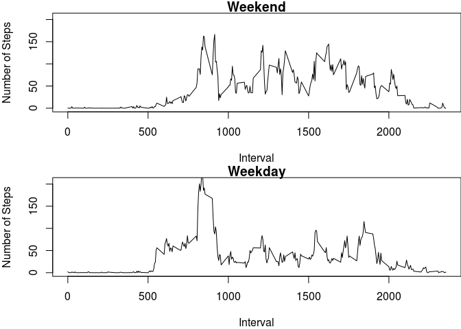

# Reproducible Research: Peer Assessment 1


## Loading and preprocessing the data

```r
data_activity<-read.csv('activity.csv');
```


## What is mean total number of steps taken per day?

```r
data_step_per_date<-aggregate(data_activity$step, by=list(Date=data_activity$date), FUN=sum,na.rm=TRUE);
hist(data_step_per_date$x,main='The total number of steps taken each day',xlab='Total number of steps');
```

 

###  Mean number of steps taken each day

```r
mean(data_step_per_date$x);
```

```
## [1] 9354.23
```

###  Median number of steps taken each day

```r
median(data_step_per_date$x);
```

```
## [1] 10395
```


## What is the average daily activity pattern?

```r
data_average_step_per_interval<-aggregate(data_activity$step, by=list(Interval=data_activity$interval), FUN=mean,na.rm=TRUE);
plot(data_average_step_per_interval$Interval,data_average_step_per_interval$x,type='l');
```

 

### 5-minute interval containing the maximum number of steps

```r
data_max_average_step_per_date<-subset(data_average_step_per_interval, x==max(data_average_step_per_interval$x), select=c(Interval, x));
head(data_max_average_step_per_date);
```

```
##     Interval        x
## 104      835 206.1698
```


## Imputing missing values
The missing values are calculated by the mean for that 5-minute interval.

### Number of missing values

```r
sum(is.na(data_activity$step));
```

```
## [1] 2304
```

### Histogram of the total number of steps taken each day after missing values were imputed

```r
data_activity$AverageStepPerInterval<-data_average_step_per_interval$x[match(data_activity$interval,data_average_step_per_interval$Interval)];
data_activity$CalculatedStep<-ifelse(is.na(data_activity$step),data_activity$AverageStepPerInterval,data_activity$step);
data_step_per_date_with_calculatedStep<-aggregate(data_activity$CalculatedStep, by=list(Date=data_activity$date), FUN=sum,na.rm=TRUE);
hist(data_step_per_date_with_calculatedStep$x,main='The total number of steps taken each day',xlab='Total number of steps');
```

 

### Mean of the total number of steps taken each day after missing values were imputed

```r
mean(data_step_per_date_with_calculatedStep$x);
```

```
## [1] 10766.19
```

### Median of the total number of steps taken each day after missing values were imputed

```r
median(data_step_per_date_with_calculatedStep$x);
```

```
## [1] 10766.19
```


## Are there differences in activity patterns between weekdays and weekends?

```r
data_activity$weekday_weekend<-as.factor(ifelse(is.element(as.character(weekdays(as.Date(data_activity$date))),c('Sunday','Saturday')),'weekend','weekday'));
data_activity_weekday<-subset(data_activity, as.character(weekday_weekend)=='weekday', select=c(interval, CalculatedStep));
data_activity_weekend<-subset(data_activity, as.character(weekday_weekend)=='weekend', select=c(interval, CalculatedStep));
data_weekday_average_step_per_interval<-aggregate(data_activity_weekday$CalculatedStep, by=list(Interval=data_activity_weekday$interval), FUN=mean,na.rm=TRUE);
data_weekend_average_step_per_interval<-aggregate(data_activity_weekend$CalculatedStep, by=list(Interval=data_activity_weekend$interval), FUN=mean,na.rm=TRUE);
par(mfrow=c(2,1),mar=c(4,4,1,0));
plot(data_weekend_average_step_per_interval$Interval,data_weekend_average_step_per_interval$x,type='l',main='Weekend',xlab='Interval',ylab='Number of Steps',ylim=c(0,max(data_average_step_per_interval$x)));
plot(data_weekday_average_step_per_interval$Interval,data_weekday_average_step_per_interval$x,type='l',main='Weekday',xlab='Interval',ylab='Number of Steps',ylim=c(0,max(data_average_step_per_interval$x)));
```

 
